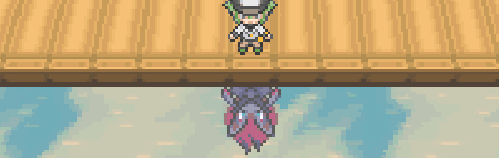
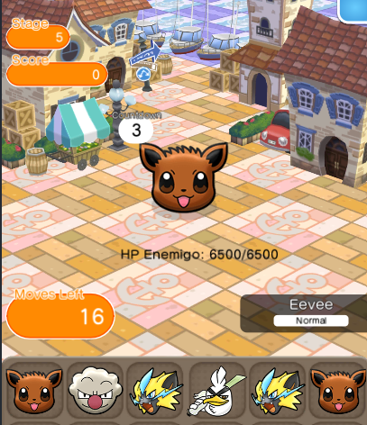
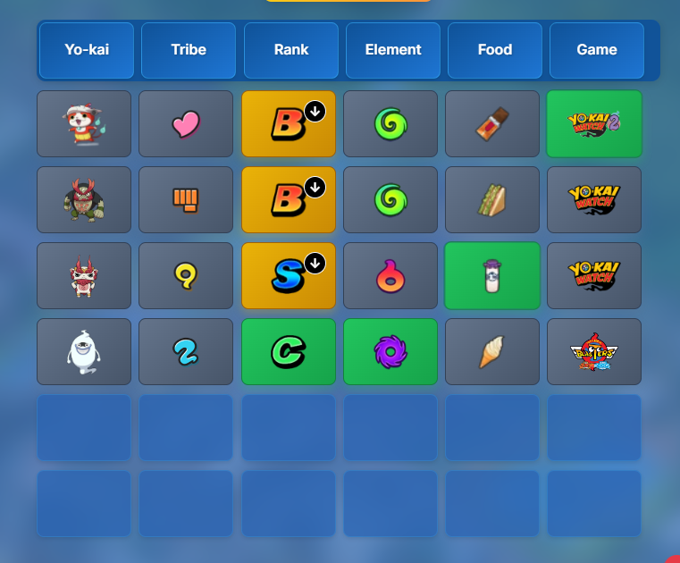

 

  
  <h1 align="center">Hi, I'm Mixel</h1>
  <h3 align="center">Game & App Developer from Spain.</h3>

   

  

    I am a developer passionate about building <b>games, apps, and experimental projects</b>. I enjoy exploring new technologies (like Raspberry Pi and new game engines) and turning crazy ideas into interactive experiences.
  

   

  <h2>💻 Tech Stack</h2>
  
  <table align="center">
    <tr>
      <td align="center" width="33%"><b>Frontend & Mobile</b></td>
      <td align="center" width="33%"><b>Game Dev</b></td>
      <td align="center" width="33%"><b>Backend & Tools</b></td>
    </tr>
    <tr>
      <td align="center">
        
        
        
      </td>
      <td align="center">
        
        
        
      </td>
      <td align="center">
        
        
        
        
      </td>
    </tr>
  </table>

   

  <h2>🚀 Featured Projects</h2>
  
  <table border="0">
    <tr>
      <td width="50%" align="center">
        <h3> Pokémon ReShuffled</h3>
        
          
        

            A fan-remake of the mobile game "Pokémon Shuffle".
        

        

            
        

        <a href="https://github.com/mixel34p/pokemon-shuffle-ex"><strong>View Code</strong></a>
      </td>
      <td width="50%" align="center">
        <h3>Yo-kaidle</h3>
        
          
        

            A wordle-like game inspired in Yo-kai Watch.
        

        

            
        

        <a href="https://github.com/mixel34p/Yo-kaidle"><strong>View Code</strong></a> | <a href="https://yokaidle.vercel.app"><strong>Play</strong></a>
      </td>
    </tr>
  </table>
   
  <h2>🛠️ Other Projects</h2>

- 👻 [**Yo-kai Watch API**](https://github.com/mixel34p/yokaiwatch-api) – A public API with all Yo-kai, their tribe, favorite food, first game appearance, rank and images.
   

  <h2>📊 GitHub Stats</h2>
  
  <table align="center">
    <tr>
      <td>
        
      </td>
      <td>
        
      </td>
    </tr>
  </table>
  
  

    

  
  
    
  

